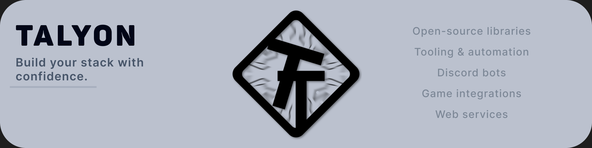

# Talyon

### What do we actually do?

  

We maintain a high variety of software, from free and open source to closed source high-end premium apps.
Maybe you even use something we've built, and you don't know it.

## What technologies do we use?

  

## Want to join or contact us?

discord: https://dc.talyon.top/ 

website: https://talyon.top/
